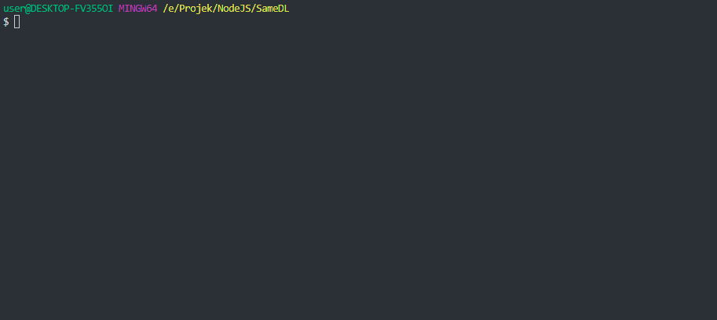

```
╔═╗╔═╗╔╦╗╔═╗╦ ║╔═╗╔╦╗╔═╗╦╔═║ ╦  ╦  ╔═╗╦ ╦╔═╗╔╦╗╦╔╗║
╚═╗╠═╣║║║║╣ ╠═╣╠═╣ ║║╠═╣╠╩╗║ ║  ║  ║╣ ║║║╠═╣ ║ ║║║║
╚═╝║ ║╩ ╩╚═╝║ ╩║ ║═╩╝║ ║╩ ╩╚═╝  ╚═╝╚═╝╚╩╝╩ ╩ ╩ ╩║╚╝
```

# Samehadaku Lewatin

[](https://nodei.co/npm/samehadaku-lewatin/)

 

🏃‍ Just Bypassing URL Shorter Using Node.js From Samehadaku.tv

# Install With NPM

```
$ npm install samehadaku-lewatin -g
```

# Use With NPX

```
$ npx samehadaku-lewatin <args>
```

# Install With Git

Clone This Repository

```
$ git clone https://github.com/anasrar/Samehadaku-Lewatin.git samehadaku
```

Change Directory

```
$ cd samehadaku
```

## Install Dependencies

```
$ npm install
```

## Link Into Binary

```
$ npm link
```

# How To Use

Get List Anime From Homepage
```
$ samehadaku list
```



___

Get List Anime From Specific Page
```
$ samehadaku page 3
```

Get List Anime From Search Page
```
$ samehadaku search "some anime"
```

Get List Anime From URL Page
```
$ samehadaku from "https://www.samehadaku.tv/2019/04/fairy-tail-episode-304-subtitle-indonesia.html"
```

Save All Link Quality From Specific Page Use Flag ```-s``` or ```--save```
```
$ samehadaku list -s
```
```
$ samehadaku page 2 --save
```
```
$ samehadaku search "some anime" -s
```
```
$ samehadaku from "https://www.samehadaku.tv/2019/04/fairy-tail-episode-304-subtitle-indonesia.html" --save
```

Link Save In JSON Format On Some .txt File

# Changelog
[HERE](CHANGELOG.md)

# License

This project is licensed under the MIT License - see the [LICENSE](LICENSE) file for details