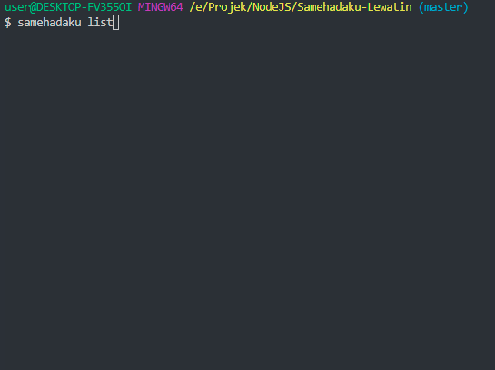

```
╔═╗╔═╗╔╦╗╔═╗╦ ║╔═╗╔╦╗╔═╗╦╔═║ ╦  ╦  ╔═╗╦ ╦╔═╗╔╦╗╦╔╗║
╚═╗╠═╣║║║║╣ ╠═╣╠═╣ ║║╠═╣╠╩╗║ ║  ║  ║╣ ║║║╠═╣ ║ ║║║║
╚═╝║ ║╩ ╩╚═╝║ ╩║ ║═╩╝║ ║╩ ╩╚═╝  ╚═╝╚═╝╚╩╝╩ ╩ ╩ ╩║╚╝
```

# Samehadaku Lewatin

 

Just Bypassing URL Shorter Using Node.js From Samehadaku.tv

# Installing

Clone This Repository

```
$ git clone https://github.com/anasrar/Samehadaku-Lewatin.git samehadaku
```

Change Directory

```
$ cd samehadaku
```

## Install Dependencies

```
$ npm install
```

## Link Into Binary

```
$ npm link
```

# How To Use

Get List Anime From Homepage
```
$ samehadaku list
```



___

Get List Anime From Specific Page
```
$ samehadaku page 3
```

Get List Anime From Search Page
```
$ samehadaku search "some anime"
```

Save All Link Quality From Specific Page Use Flag ```-s``` or ```--save```
```
$ samehadaku list -s
```
```
$ samehadaku page 2 --save
```
```
$ samehadaku search "some anime" -s
```

Link Save In JSON Format On Some .txt File

# Changelog
## 2.0.1 - 13/04/2019
### Added
- Command Search
- Add Select Next And Prev Page
- Optimizing Code

## 1.2.9 - 23/02/2019
### Added
- Command Save 1 Quality Link As Text File https://github.com/anasrar/Samehadaku-Lewatin/issues/1
- Command Page
- Optimizing Code

## 1.2.8 - 22/02/2019
### Added
- Copy to clipboard
- New Safelink URL [ siherp.com ]

# License

This project is licensed under the MIT License - see the [LICENSE](LICENSE) file for details